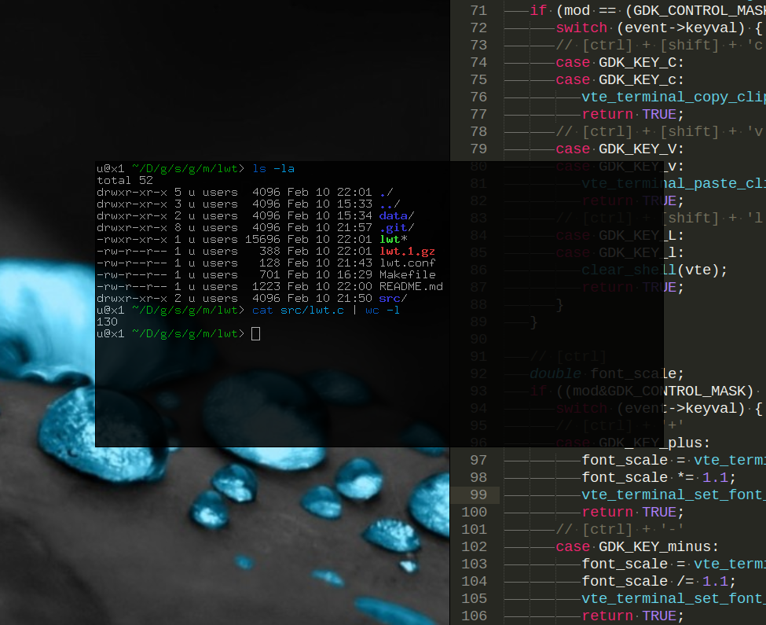

# lwt

`lwt` is a lightweight terminal emulator based on the [VTE] and [GTK] libraries.

[VTE]: https://developer.gnome.org/vte/
[GTK]: http://www.gtk.org/

## Screenshot

The font, shell and optional transparency are all configurable from [lwt.conf](lwt.conf). 



## Configuration

A configuration file stored in `~/.config/lwt/lwt.conf` may be used to specify font settings, shell path and enable optional transparency.

[Example config](lwt.conf):
```
[lwt]
font = "Fixed 11"
shell = "/usr/bin/fish"
# Remove the opacity key or set it to 1 to disable transparency.
opacity = 0.85
```

## Key bindings

The default key bindings of VTE are extended with the following:

* `[ctrl] + [shift] + 'c'`
    - Copy selection
* `[ctrl] + [shift] + 'v'`
    - Paste clipboard
* `[ctrl] + [shift] + 'l'`
    - Reset scrollback
* `[ctrl] + '+'`
    - Increase font size
* `[ctrl] + '-'`
    - Decrease font size

## Installation

```
$ make
$ sudo make install
$ mkdir -p ~/.config/lwt/
$ cp lwt.conf ~/.config/lwt/lwt.conf
```

## Packages

Arch Linux users can install `lwt` using the following [AUR package](https://aur.archlinux.org/packages/lwt-git/).

## Changes

* Version 0.1 (2016-02-10)
    - Initial release.
    - Minimal terminal emulator (less than 200 lines of code).
    - Support for ini configuration files and optional transparency.

## Public domain

The source code and any original content of this repository is hereby released into the [public domain].

[public domain]: https://creativecommons.org/publicdomain/zero/1.0/
